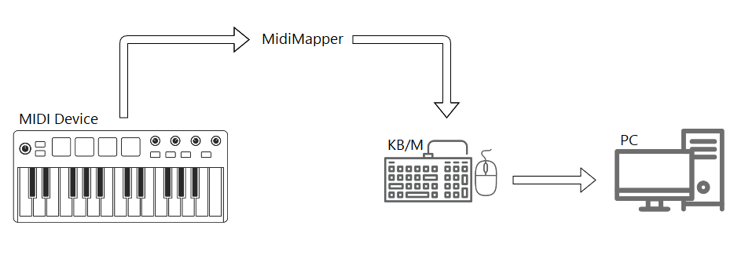
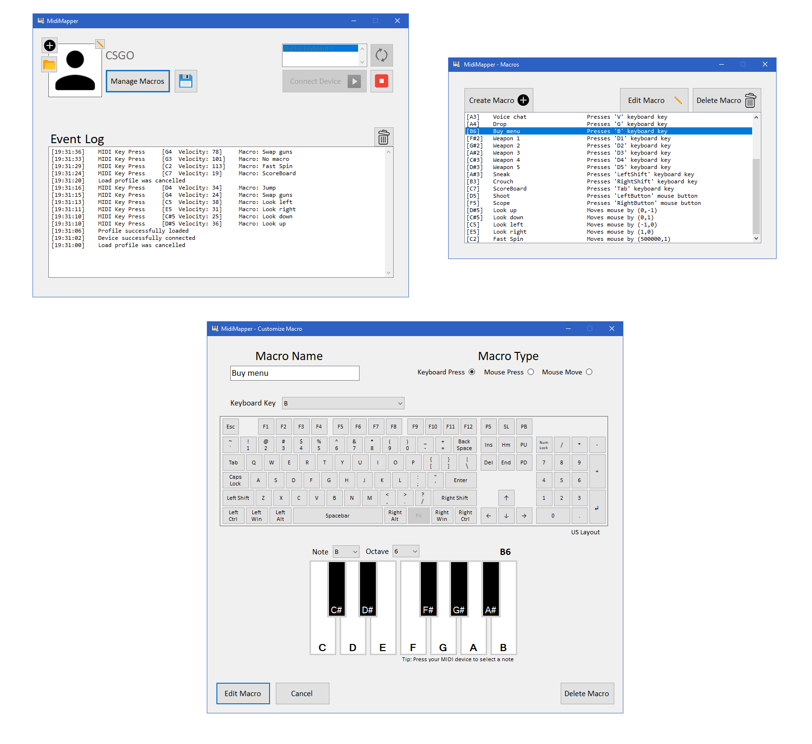
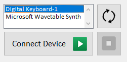

# MidiMapper

## Overview
MidiMapper is a Windows Form Application that maps MIDI signals into customizable keyboard/mouse input. The keyboard/mouse input is done using the [InputManager library](https://www.codeproject.com/Articles/117657/InputManager-library-Track-user-input-and-simulate) which supports DirectX and therefore allows in-game inputs. To receive and process MIDI messages the application uses [NAudio](https://github.com/naudio/NAudio) as a library.

The application allows for profiles to be created and loaded. This way it is possible to easily switch between user-made profiles. These profiles can be described through `.txt` files as explained [here](#profile-file-syntax) or can be managed via the application's interface.

The following diagram displays the system's overview:



## Table of Contents
- [Functionalities](#functionalities)
- [Preview](#preview)
- [MIDI Device Setup](#midi-device-setup)
- [User Profiles](#user-profiles)
  - [Profile File Syntax](#profile-file-syntax)
- [Credits](#credits)

## Functionalities
MidiMapper exposes the following functionalities:
- Functional and intuitive Windows Form Application to map MIDI signals into keyboard/mouse input
- MIDI device selection
- Run in background option
- Event Log which displays the keys being pressed and its respective macros
- Profile management
  - Create unlimited profiles with sets of macros
  - Customize macros
    - Add/Edit/Delete
    - Add a title to describe a macro
    - Support for keyboard/mouse actions as macros 
  - Save profiles to `.txt` files
  - Load profiles into MidiMapper

## Preview


## MIDI Device Setup
MidiMapper's interface displays a selection of connected MIDI devices allowing the user to pick the desired one. Furthermore, the application provides buttons to start and stop the listening of key presses on the selected device.

In order to avoid unexpected errors, make sure the MIDI drivers for the specific device are correctly installed!

The following image exhibits an example of the device selection provided by the application's interface:

<p align="center">
  
</p>

## User Profiles
Although the application's interface allows for profiles to be saved and loaded, it is possible to manually describe them via `.txt` files. A faster management of profiles can be achieved by utilizing this method and using the correct syntax for the profile's serialization.

Examples of possible profiles can be found in the [My Profiles](My%20Profiles) folder.

### Profile File Syntax
The overall syntax of a file that describes a profile has the following structure:
```txt
PROFILE NAME

Macro 1
Macro 2
...
```

Each macro requires the following parameters:
- Macro Name
  - Describes the macro functionality
  - Maximum size of 25
- Musical Note
  - Musical note which activates the respective macro
  - Must be any of `["C", "C#", "D", "D#", "E", "F", "F#", "G", "G#", "A", "A#", "B"]` + octave`[2-9]` (e.g: `C#4`)
- Macro Type
  - The type of the macro (e.g: KBD_Press, Mouse_Press, Mouse_Move)
  - Must be present in the [MacroType](MidiMapper/Source/Macros/Macro.cs) Enum (letter casing and underscores are ignored)
- Macro Function
  - Defines the function based on the macro type
  - Specific to each type

Each macro must be serialized with the 4 parameters delimited by the `;` character such as follows:
```txt
name;note;type;function
```

Currently, the list of supported macros and its respective syntax are:
- Keyboard Press
  - Described by the keyboard key name present in the [KeyboardKeys](MidiMapper/Source/Enums/KeyboardKeys.cs) Enum (e.g: `W`)
- Mouse Button Click
  - Described by the mouse button name present in the [MouseButtons](MidiMapper/Source/Enums/MouseButtons.cs) Enum (e.g: `LeftButton`)
- Mouse Movement
  - Described by (x, y) integer coordinates (e.g: `(0, -1)`)


Below is an example of a possible profile file:
```txt
My Profile

Walk forward;D#4;KBD_Press;W
Shoot;D5;Mouse_Press;LeftButton
Look up;D#5;Mouse_Move;(0,-1)
```

## Credits
All icons used in MidiMapper's design were taken from [icons8](https://icons8.com/).

Application developed by:
- [TiagoMMDavid](https://github.com/TiagoMMDavid)